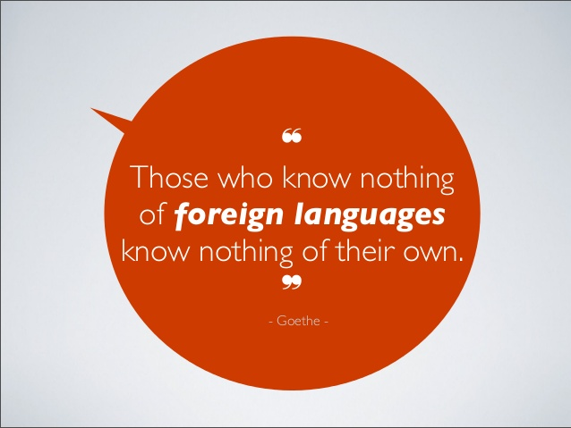
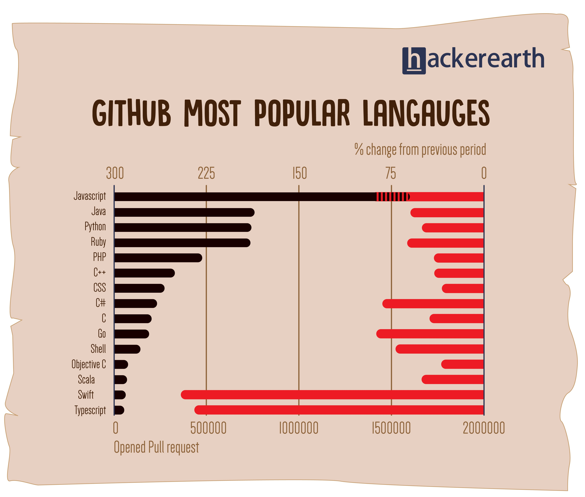

theme: Sketchnote

# [fit] www.buoydontfloat.com/programming-languages

<br>

Instructions to:
1. Get the github repo
2. Open the `hackmd`
3. Link to repl.it

^ TODO: don't forget to put this page live =P

---

# [fit] Intro to Programming Languages 101

### For Future Presidents

---

### Working Title

## [fit] Why can't I use javascript everywhere?

---

## Why am I here? Why study other programming languages when I'm not even good at one?

---

# About me

level 31 human
software engineer @ dia&co
full-stack web developer <3 ruby & rails
~10 points in programming skills
emerging artist

---

# About you

---

## Why am I here? Why study other programming languages when I'm not even good at one?

---


---

> “Learning another language is not only learning different words for the same things, but learning another way to think about things.” ‒Flora Lewis

^
 Physiological studies have found that speaking two or more languages is a great asset to the cognitive process. The brains of bilingual people operate differently than single language speakers, and these differences offer several mental benefits. Below are seven cognitive advantages to learning a foreign language

 I didn't really get a lot of English concepts until I started learning spanish:
 conjugations, past participles, tenses, grammar & sentence structure, idioms

---



^
This quote I googled is actually in motivation of learning foreign languages.
Funny, we learn it in high school as a mandatory thing, but I forget why?
But basically, I'm telling you that there's value in learning an additional language.
Sure, you've yet to master one language, and that's OK! This is an exercise to help you master that language,
Giving you a second context from which to view the first from afar, and in essence get a better sense of WTF you're doing.

---

Code surrounds us
It's an increasingly useful skillset
Anthony's a cool guy I wonder what he has to say

^ TODOL this needs a few more... or additional slides?

---

# What is programming?

> Coming up with a set of instructions to tell a dumb machine to do something

---

# What is a programming language?

A set of rules that provide a way of telling a dumb machine what operations to perform.

Essentially, a linguistic framework for describing these operations.

---


---

# Why the fuck do we need so many programming languages?

---


---

0. History*
1. Syntax
2. Semantics
3. Idioms
4. Libraries
5. Tools
6. Community

---

# History

Languages are made by people

Essentially, some Jane decides she wants to create a new language to better suit a problem she is solving or to better express code how *she* wants.

^ I think this is important because programming languages tend to have areas where they excel in. And they definitely show quirks of the inventor.

---

# javascript

JavaScript, originally called Mocha and not to be confused with Java, was created in 10 days in May 1995 by Brendan Eich for Netscape.

Created for the Netscape browser as a more approachable scripting language to make the web more dynamic.

^
Designed in a hurry and strongly modeled after Scheme and Self
But because of working relationship with Sun, adopted a lot of Java's syntax
Basically, renamed in a co-marketing deal to piggy-back on the popularity of JAVA!

---

> "Java is to JavaScript what Car is to Carpet"
> – some guy on StackOverflow

^ They are really different languages!

---

# ruby

^
Ruby - A Programmer's Best Friend (TM)
go the homepage: ruby-lang.org

---

# ruby

Yukihiro Matsumoto or "Matz"

A programming language focused on developer happiness!

---

# [fit] Q: Did you have a guiding philosophy when designing Ruby?

Yes, it's called the "principle of least surprise."

I believe people want to express themselves when they program. They don't want to fight with the language.

I tried to make people enjoy programming and concentrate on the fun and creative part of programming when they use Ruby.

---

0. History
1. Syntax*
2. Semantics
3. Idioms
4. Libraries
5. Tools
6. Community

---

# Syntax

the simplest part of a programming language...

how to actually use it, e.g.
symbols
keywords
reserved words
operators
expressions
delimiters

^ TODO: Describe it in one slide!
Most languages have the same functionality, but different keywords or symbols to invoke them!

pro tip: when you're googling syntax, add the keyword "example"

---

`human@buoydontfloat.com`

---

# SYNTAX DEMO

---

0. History
1. Syntax
2. Semantics*
3. Idioms
4. Libraries
5. Tools
6. Community

---

# Semantics

Syntax is the concept that concerns itself only whether or not the sentence is valid for the grammar of the language.
Semantics is about whether or not the sentence has a valid meaning.

Think of it as the evaluation rules of the language.

---

Crash can mean auto accident, a drop in the Stock Market, to attend a party without being invited, ocean waves hitting the shore or the sound of a cymbals being struck together.

---

# SEMANTICS DEMO

---

0. History
1. Syntax
2. Semantics
3. Idioms*
4. Libraries
5. Tools
6. Community

---

# Idioms

Every Dog Has His Day
Tomar El Pelo
Head in the Clouds

This is where you get expert-level at a language!

---

# IDIOMS DEMO


---

0. History
1. Syntax
2. Semantics
3. Idioms
4. Libraries*
5. Tools
6. Community

---

# Libraries

existing code you can use

because it would take too long to build some of these:

math, crypto, file input/output, etc.

---

# Libraries

standard library

libraries baked into the programming language

third-party libraries

libraries available to you via the community, e.g. open-source

---

# Libraries

## package managers

`npm`, `gem`, `pip`, `brew`, `yum`, `luarocks`

---

## javascript

```
npm install superb
```

## ruby

```
gem install awesome_print
```

---

0. History
1. Syntax
2. Semantics
3. Idioms
4. Libraries
5. Tools*
6. Community

---

# TOOLS

## What's available to work with the programming language?


---

# TOOLS: Editors

## Integrated Development Environment (IDE)
arduino IDE
eclipse / jetbeans / xcode / rubymine

## Text Editors
atom / sublime / vim / etc.

---

# TOOLS: With a Purpose
processing
p5
python notebook

---

# TOOLS: Frameworks
rails
express
wordpress
react / angular / ember

^ There's some overlap as I presented them, but think of these as BIGGER libraries and other tools

---

0. History
1. Syntax
2. Semantics
3. Idioms
4. Libraries
5. Tools
6. Community*

---

# Community

What problems are people solving?

stability
open-source
support
conferences
influencers

---



---

# What problems are people using that programming language focused on solving?

---

# ruby

developer happiness
web development
server-side scripting

### examples
rails / sinatra

---

# python
deeply entrenched in academia
lots of sophisticated math libraries and tools

### examples
python notebook
numpy / scipy
tensorflow

---

## javascript

everyone
everything

### examples
nodejs
asynchronous
reactjs / vuejs / angularjs / emberjs

---

# C / C++

fast fast fast
stable

### examples
openframeworks
openCV / computer vision
native code, e.g. iOS apps, application binaries

---

# How nice is the community? Approachability?

---

# ruby

MINSWAN (Matz is nice, so we are nice)

## C / C++

RTFM

---

# AMA

---

# Hard Topics =[

- Interpreted vs Compiled
- Object Oriented Programming
- Prototypical inheritance
- Functional vs Imperative
- static language vs dynamic language
- strong and weak typing
- Closures
- asynchronous is hard
- Different implementations of ruby-lang
- What qualifies as a programming language and why CSS/HTML don't count

---

# Factorial

Write a function that takes a number _n_ and returns the factorial (sum of numbers 1 to _n_), e.g.

```
factorial(1) => 1
factorial(3) => 6
factorial(7) => 5,040
```

---

# FizzBuzz

Write a program that prints the numbers from 1 to 100. But for multiples of three print “Fizz” instead of the number and for the multiples of five print “Buzz”. For numbers which are multiples of both three and five print “FizzBuzz”.

---

# Prime Numbers

Write a program that prints the first 100 prime numbers.

---

# Proof of Work

Write a program that takes a transaction string and appends numbers to the end to find the first SHA256 hash that starts with "000".

```
transactions = "100,anthony,alice;500,alice,bob;20,alice,anthony"
```
